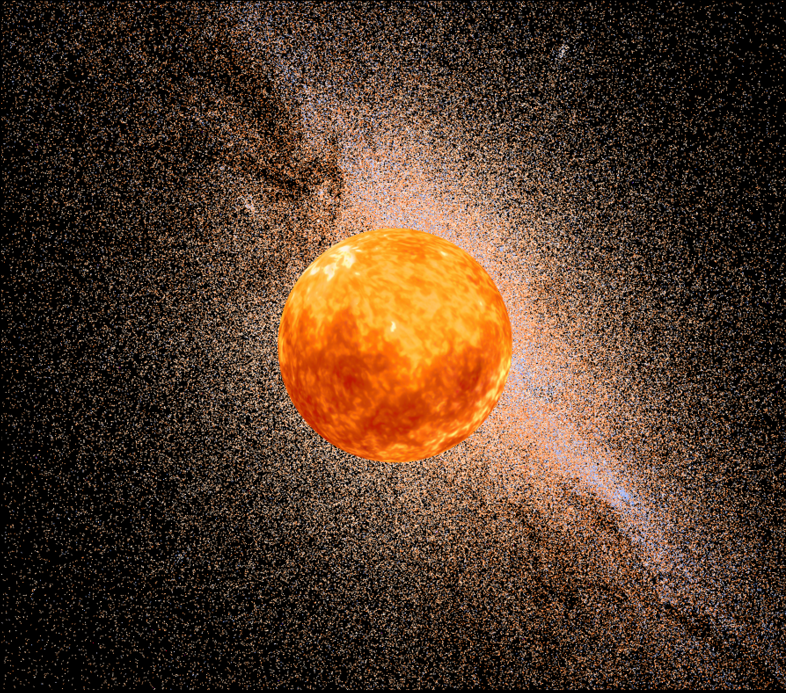

# Aether Workspace

> **Aether** - an open, strongly-typed scientific computing framework for aerospace and physics simulation in Rust.



This workspace contains the family of crates that make up **Aether**, a modular library suite for high-fidelity dynamics, control, and visualization.  
Aether was designed to enable rigorous, reference-frame-aware computation for spacecraft, aircraft, and robotic systems - without sacrificing performance or clarity. Please feel free to contribute your own models, mathematics, and thoughts on this work.

---

## Scientific Intent

Aether was originally developed as part of my internal research ecosystem for **Guidance, Navigation, and Control (GNC)**, **physics-based simulation**, and **model-predictive optimization**.  
The intent behind publishing these crates is to **advance open, verifiable research in scientific computing** and **promote reproducibility in aerospace and control theory**.

Our goals for the open library family are:

1. **Transparency and reproducibility** - scientific methods should be inspectable, not black boxes.
2. **Type-safe physics** - coordinate frames, units, and state representations should be encoded in the type system.
3. **Performance through purity** - numerics should compile down to optimal code paths, suitable for HPC and embedded environments alike.
4. **Interdisciplinary reusability** - the same primitives should serve orbital dynamics, machine learning, and structural analysis.
5. **Open acceleration of science** - researchers, students, and engineers should be able to build upon a common foundation of reliable math and simulation code.

Aether's open core is therefore made public to contribute to a verifiable, type-safe, and hardware-accelerated ecosystem for computational physics.

---

## Workspace Structure

This workspace collects the following crates:

| Crate | Description |
|-------|--------------|
| **aether** | Umbrella crate aggregating core modules for convenience. |
| **aether_core** | Strongly-typed math foundation - matrices, vectors, quaternions, and reference frame abstractions. |
| **aether_models** | Physical and dynamical models (rigid bodies, atmosphere, gravitation, etc.). |
| **aether_fluids** | Fluid dynamics and continuum-mechanics primitives. |
| **aether_shapes** | Geometric primitives for collision, inertia, and volumetric modeling. |
| **aether_graphics** | Rendering and visualization utilities for simulation and analysis. |
| **aether_ml** | Lightweight scientific machine learning and regression utilities integrated with Aether math types. |
| **aether_opt** | Optimization and control algorithms (gradient descent, Riccati solvers, MPC scaffolding). |
| **aether_rand** | Deterministic RNGs and sampling utilities for simulations. |
| **aether_stats** | Statistical analysis, regression, and signal-processing tools. |
| **aether_benchmark** | Performance tests and HPC kernels for benchmarking Aether numerics. |

---

## Philosophy

Aether is built on three core principles:

1. **Strong Types for Strong Science**  
   Physical correctness is encoded at compile-time using the Rust type system.  
   Reference frames, units, and coordinate systems are not strings - they are types.

2. **Numerical Transparency**  
   Every algorithm is written with clear linear-algebraic intent, leveraging static matrices, explicit arithmetic, and traceable computation steps.

3. **Unified Continuum**  
   Whether simulating a spacecraft’s attitude, a fluid field, or a statistical regression, all Aether crates share the same mathematical substrate.

---

## Build and Usage

To build the entire workspace:

```bash
git clone https://github.com/atmopierce/aether.git
cd aether
cargo build --release
```

To include a singular package via git
```toml
[dependencies]
aether_core = { git = "https://github.com/atmopierce/aether.git", package = "aether_core" }
```

## Examples
```rust
use aether_core::math::{Matrix, Vector};

fn main() {
    // Define a 3×3 rotation matrix (example: 45° rotation about Z-axis)
    let theta = std::f64::consts::FRAC_PI_4;
    let rot_z = Matrix::<f64, 3, 3>::new([
        [ theta.cos(), -theta.sin(), 0.0 ],
        [ theta.sin(),  theta.cos(), 0.0 ],
        [ 0.0,          0.0,         1.0 ],
    ]);

    // Define a 3×1 vector (position, velocity, or generic state)
    let v = Vector::<f64, 3>::new([1.0, 0.0, 0.0]);

    // Apply the rotation
    let v_rot = rot_z * v;

    println!("Rotated vector: {:?}", v_rot);
}
```

Aether encodes reference frames in the type system, and gives you physically meaningful transforms as first-class functions.

Below we’ll:
1. Define a vector in the **Body** frame of an aircraft/vehicle.
2. Rotate it into local **NED** (North-East-Down) using `body_to_ned(...)`.
3. (Optionally) map that NED vector into an Earth-fixed frame using `ecef_to_ned(...)`.

```rust
use aether_core::attitude::DirectionCosineMatrix;
use aether_core::coordinate::Cartesian;
use aether_core::reference_frame::{Body, NED, ITRF};
use aether_core::reference_frame::transforms::{body_to_ned, ecef_to_ned};

fn main() {
    // Example 1: gravity measured in the BODY frame
    //
    // Imagine an IMU on a vehicle. In body coordinates, it "sees" gravity
    // along +X (nose-forward) due to pitch attitude.
    let gravity_body: Cartesian<f64, Body<f64>> = Cartesian::new(9.8, 0.0, 0.0);

    // Current attitude: roll, pitch, yaw (rad)
    let roll  = 0.0_f64.to_radians();
    let pitch = -90.0_f64.to_radians(); // nose straight down
    let yaw   = 0.0_f64.to_radians();

    // Build the Body -> NED direction cosine matrix from Euler angles.
    // body_to_ned() returns a DirectionCosineMatrix<Body, NED>.
    let dcm_body_to_ned: DirectionCosineMatrix<f64, Body<f64>, NED<f64>> =
        body_to_ned(roll, pitch, yaw);

    // Rotate the measurement into NED coordinates.
    let gravity_ned: Cartesian<f64, NED<f64>> = dcm_body_to_ned * gravity_body;

    println!("Gravity in body frame: {}", gravity_body);
    println!("Gravity in NED frame:  {}", gravity_ned);

    // At this point, gravity_ned is tagged as NED<f64>, so downstream code
    // cannot accidentally treat it as if it's already in Earth-fixed or inertial
    // coordinates. The frame is part of the type.

    // ---------------------------------------------------------
    // Example 2: connect local navigation to Earth-fixed
    // ---------------------------------------------------------

    // Suppose we know where we are on Earth:
    let latitude  = 34.7304_f64.to_radians();   // e.g. Huntsville, AL
    let longitude = -86.5861_f64.to_radians();

    // Build the ECEF(ITRF) -> NED transform at that geodetic location.
    // ecef_to_ned() returns DirectionCosineMatrix<ITRF, NED>.
    let dcm_ecef_to_ned: DirectionCosineMatrix<f64, ITRF<f64>, NED<f64>> =
        ecef_to_ned(latitude, longitude);

    // If we had some global force/velocity/etc. in ITRF/ECEF, we could move it into
    // local navigation frame with dcm_ecef_to_ned. Conversely, its inverse (or `.transpose()`
    // if you expose that) moves local NED vectors back to Earth-fixed coordinates.

    // This gives you an auditable pipeline like:
    // Body --> NED --> ITRF --> ICRF
    // with no chance of "oops I mixed frames" bugs.
}
```

## Citation
Michael Angeles. Aether: A Strongly-Typed Scientific Computing Framework for Simulation in Rust. 2025.
https://github.com/atmopierce/aether

## Contributing
While Aether is primarily developed in support of my research, community contributions are welcome - especially those improving mathematical clarity, documentation, or academic integration (e.g., external bindings, notebooks, examples).

Please open an issue or pull request if you wish to contribute.